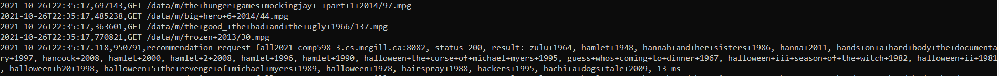

Developed full stack movie recommendation system 

Steps to run the project on the server :
 - Log into the server 
 - Clone project on server
 - Open project: `cd Team3` 
 - `chmod +x start.sh` 
 - Launch start script to build docker and run it: `./start.sh`

Results:

